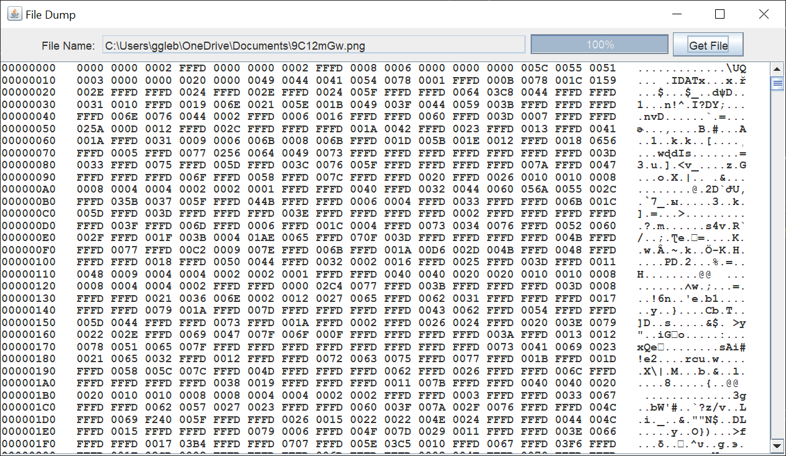
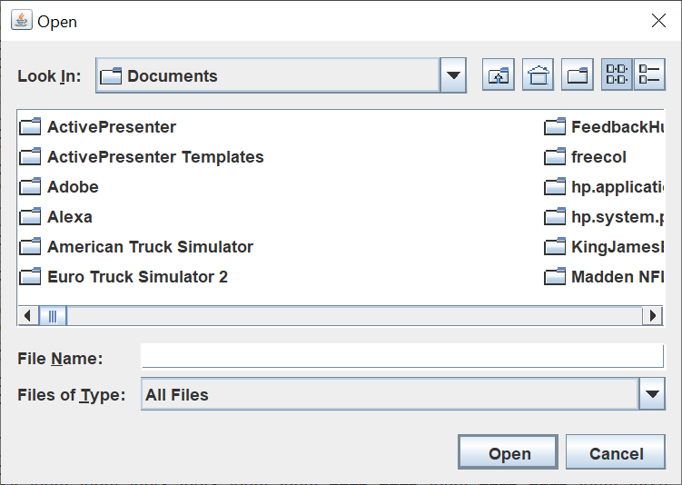

# File Dump

## Introduction

Some time back, I needed to see the contents of a MIDI file I was working with.  Rather than download something, I decided to write my own Java Swing file dump, based on file dump applicatrions I remembered from my days as a mainframe COBOL programmer.

Here's what the GUI looks like with a PNG file.

Here's the file chooser that allows you to choose a file.

## Explanation

If you’re not familiar with Java Swing, Oracle has an excellent tutorial to get you started, [Creating a GUI With JFC/Swing](https://docs.oracle.com/javase/tutorial/uiswing/index.html). Skip the Netbeans section.

When I create a Swing GUI, I use the [model / view / controller](https://en.wikipedia.org/wiki/Model%E2%80%93view%E2%80%93controller) (MVC) pattern.  This pattern allows me to separate my concerns and focus on one part of the application at a time.

The model for this Java application is pretty simple.  It consists of a File instance holding the current file being displayed.  This model allows me to keep track of the current directory, so you can easily look at multiple files from the same directory.  When the application starts, the current directory defaults to your Documents directory in Windows.

The view for this Java application consists of a JFrame with two subordinate JPanels.  The first subordinate JPanel holds the JTextFIeld with the current file path, a JProgressBar as an indicator for large file loading, and a JButton to bring up the JFileChooser.  The second subordinate JPanel holds a JTextArea inside a JScrollPane.

The controller for this Java application consists of two classes.  One button listener class shows the file chooser, gets the selected File instance, and starta a Thread to read the file and display the contents.  The Runnable class reads the file and creates the file dump display in the text area.
